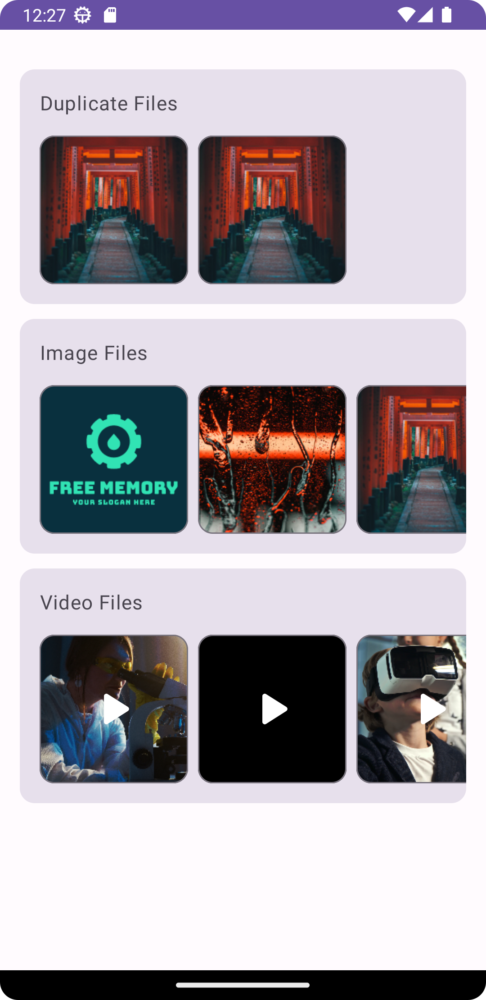

  

# Free Memory

Free Memory is a free and open-source software for Android devices that helps users clean their phone storage by identifying and suggesting categories where they can reduce occupied space. It aims to address the problem of unnecessary data occupying a significant portion of mobile memory.

  

## Features

- **Delete Duplicate Files**: Identify and remove duplicate files to free up storage space.
- **Select and Delete Multiple Photos and Videos**: Easily select and delete multiple photos and videos to reclaim storage.
- **Supports Dark Theme**: Depends upon the phone if dark mode is on then theme of the App will be dark as well.

## Technologies Used

- Kotlin
- Android Studio (IDE)
- Jetpack Compose
- Material3 design
- MVVM (Model-View-ViewModel) architectural pattern
- Compose Navigation
- LiveData for updating UI
- Flow and Coroutines for asynchronous programming
- Clean architecture
- Room for database management
- Coil for displaying images and thumbnails
- Exoplayer for video files
- Sentry for measuring production performance

## Installation

Currently, there are no specific installation or setup instructions. Simply install the app on your Android device to get started.

## Usage

To run the project, follow these steps:

1. Install the APK file on your Android device.
2. Open the "Free Memory" app.
3. Explore the different categories suggested by the app to identify areas where you can free up storage.
4. Use the provided features to delete duplicate files or select and delete multiple photos and videos.

  

## Known Issues and Future Development

- Currently, no test cases have been written for the project.
- In the future, more categories will be added, such as screenshots, similar images, and similar videos.
- The integration of openCV for facial recognition-based categories is planned.

## Contributing

Contributions to the project are welcome! To contribute or report issues, follow these steps:

1. Visit the project's GitHub page: [link to your GitHub repository]
2. Create a detailed feature request or bug report, specifying the necessary details.
3. Anyone can pick up any TODO tasks from the project and raise a pull request to contribute.

## License

This project is open source. You can find the licensing information in the [LICENSE](LICENSE) file.

